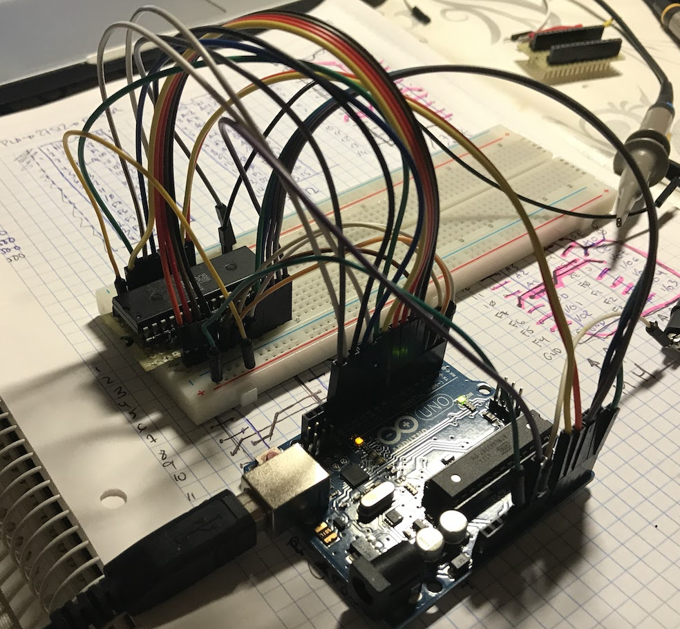

# Commodore 64 hardware test tools



I wrote these 3 programs to test the RAM, ROM and PLA chips with an Arduino Uno because I don't own a second known-working C64 to test them on.

With the help of these sketches I found my CHAROM and PLA were fried. If you are trying to repair your C64, I hope they help you too and wish you good luck!

Check the chips for electrical consistence **before** wiring, ie: inputs are not shorted, chip obeys /CS, etc.

See test details on each sketch's heading comments.

## Summary of [RAM test](c64_dram_test)

```
                                               +-----+
                  +----[PWR]-------------------| USB |--+
                  |                            +-----+  |
                  |         GND/RST2  [ ][ ]            |
                  |       MOSI2/SCK2  [ ][ ]  A5/SCL[ ] |   C5 
                  |          5V/MISO2 [ ][ ]  A4/SDA[ ] |   C4 
                  |                             AREF[ ] |
                  |                              GND[ ] |
                  | [ ]N/C                    SCK/13[ ] |   B5
                  | [ ]IOREF                 MISO/12[ ] |   B4 --- DRAM DIN
                  | [ ]RST                   MOSI/11[ ]~|   B3 --- DRAM /WE
                  | [ ]3V3    +---+               10[ ]~|   B2 --- DRAM /RAS
                  | [ ]5v    -| A |-               9[ ]~|   B1 --- DRAM /CAS
                  | [ ]GND   -| R |-               8[ ] |   B0 --- RAM DOUT
                  | [ ]GND   -| D |-                    |
                  | [ ]Vin   -| U |-               7[ ] |   D7 --- RAM A7
                  |          -| I |-               6[ ]~|   .
              C0  | [ ]A0    -| N |-               5[ ]~|   .
              C1  | [ ]A1    -| O |-               4[ ] |   .
              C2  | [ ]A2     +---+           INT1/3[ ]~|   .
              C3  | [ ]A3                     INT0/2[ ] |   .
              C4  | [ ]A4/SDA  RST SCK MISO     TX>1[ ] |   .
              C5  | [ ]A5/SCL  [ ] [ ] [ ]      RX<0[ ] |   D0 --- RAM A0
                  |            [ ] [ ] [ ]              |
                  |  UNO_R3    GND MOSI 5V  ____________/
                  \_______________________/
```
- LED (pin 13) off: TEST **PASS**
- LED (pin 13) on: TEST **FAIL** (will turn back off at the end of the test cycle, so PAY ATTENTION)


##  Summary of [ROM test](c64_rom_test)

```
                                               +-----+
                  +----[PWR]-------------------| USB |--+
                  |                            +-----+  |
                  |         GND/RST2  [ ][ ]            |
                  |       MOSI2/SCK2  [ ][ ]  A5/SCL[ ] |   C5 
                  |          5V/MISO2 [ ][ ]  A4/SDA[ ] |   C4 
                  |                             AREF[ ] |
                  |                              GND[ ] |
                  | [ ]N/C                    SCK/13[ ] |   B5 --- ROM O8
                  | [ ]IOREF                 MISO/12[ ] |   B4 --- ROM O7
                  | [ ]RST                   MOSI/11[ ]~|   B3 --- ROM A11
                  | [ ]3V3    +---+               10[ ]~|   B2 --- ROM A10
                  | [ ]5v    -| A |-               9[ ]~|   B1 --- ROM A9
                  | [ ]GND   -| R |-               8[ ] |   B0 --- ROM A8
                  | [ ]GND   -| D |-                    |
                  | [ ]Vin   -| U |-               7[ ] |   D7 --- ROM A7
                  |          -| I |-               6[ ]~|   .
   ROM O1 --- C0  | [ ]A0    -| N |-               5[ ]~|   .
   ROM O2 --- C1  | [ ]A1    -| O |-               4[ ] |   .
   ROM O3 --- C2  | [ ]A2     +---+           INT1/3[ ]~|   .
   ROM O4 --- C3  | [ ]A3                     INT0/2[ ] |   .
   ROM O5 --- C4  | [ ]A4/SDA  RST SCK MISO     TX>1[ ] |   .
   ROM O6 --- C5  | [ ]A5/SCL  [ ] [ ] [ ]      RX<0[ ] |   D0 --- ROM A0
                  |            [ ] [ ] [ ]              |
                  |  UNO_R3    GND MOSI 5V  ____________/
                  \_______________________/
```

- Random activity on LED (pin 13): TEST **PASS**
- LED is stuck either on or off: TEST **FAIL**


##  Summary of [PLA test](c64_pla_test)

```
                                               +-----+
                  +----[PWR]-------------------| USB |--+
                  |                            +-----+  |
                  |         GND/RST2  [ ][ ]            |
                  |       MOSI2/SCK2  [ ][ ]  A5/SCL[ ] |   C5 
                  |          5V/MISO2 [ ][ ]  A4/SDA[ ] |   C4 
                  |                             AREF[ ] |
                  |                              GND[ ] |
                  | [ ]N/C                    SCK/13[ ] |   B5 --- PLA I13
                  | [ ]IOREF                 MISO/12[ ] |   B4 --- PLA I12
                  | [ ]RST                   MOSI/11[ ]~|   B3 --- PLA I11
                  | [ ]3V3    +---+               10[ ]~|   B2 --- PLA I10
                  | [ ]5v    -| A |-               9[ ]~|   B1 --- PLA I9
                  | [ ]GND   -| R |-               8[ ] |   B0 --- PLA I8
                  | [ ]GND   -| D |-                    |
                  | [ ]Vin   -| U |-               7[ ] |   D7 --- PLA I7
                  |          -| I |-               6[ ]~|   .
  PLA I14 --- C0  | [ ]A0    -| N |-               5[ ]~|   .
  PLA I15 --- C1  | [ ]A1    -| O |-               4[ ] |   .
 PLA F0/4 --- C2  | [ ]A2     +---+           INT1/3[ ]~|   .
 PLA F1/5 --- C3  | [ ]A3                     INT0/2[ ] |   .
 PLA F2/6 --- C4  | [ ]A4/SDA  RST SCK MISO     TX>1[ ] |   .
 PLA F2/7 --- C5  | [ ]A5/SCL  [ ] [ ] [ ]      RX<0[ ] |   D0 --- PLA I0
                  |            [ ] [ ] [ ]              |
                  |  UNO_R3    GND MOSI 5V  ____________/
                  \_______________________/
```

- Random activity on LED (pin 13): **TEST PASS**
- A series of _n_ LED flashes: **TEST FAIL** output F<sub>n-1</sub>

## Thanks

 * [Zimmers invaluable archive of pinouts, schematics and documents](http://www.zimmers.net/anonftp/pub/cbm/index.html)
 * [~rcarlsen archive](http://personalpages.tds.net/~rcarlsen/cbm/c64/)
 * [PLA C code equations](http://www.zimmers.net/anonftp/pub/cbm/firmware/computers/c64/pla.c)
 * [Commodore 64: how to repair it, step by step](http://retro64.altervista.org/blog/commodore-64-repair-a-quick-guide-on-the-steps-required-to-fix-it/)
 * [Arduino ASCII diagrams](http://busyducks.com/ascii-art-arduinos)
 * ... and Commodore Business Machines for making the BEST COMPUTER EVER

