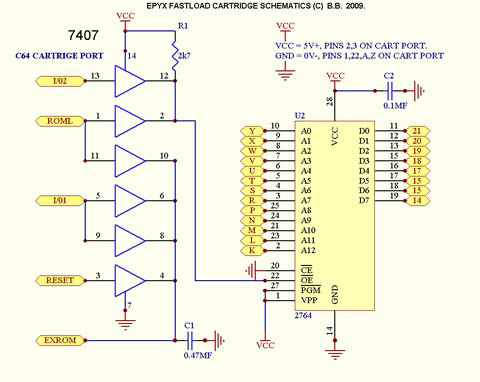

# Epyx Fastload cartridge dump tool

This machine language program dumps the Epyx Fastload (or similar) cartridge ROM to a 8 KB SEQ file on disk drive 8. It's an experiment and I doubt it will be useful for someone in the 21st century but eh.

These cartridges use a 2364 (8 KB) ROM chip and a 7407 hex buffer that provides extra logic to bank the ROM in from software.

When either ~RESET, ~I/O1 or ~ROML are pulled low, ~EXROM is also pulled down, but a capacitor in parallel prevents it from going high immediately, which makes the cartridge stay banked in for around 1 ms and then it becomes invisible again leaving the RAM between $8000-$9FFF available for BASIC.

In order to read the cartridge it needs to be banked in first by making a few reads from the $DE00..$DEFF, which will make ~I/O1 low, therefore making the cartridge's ~EXROM go low. Then copy all the contents off the ROM to a safe RAM location, from where they can be saved. Continuous reads within the $8000..$9FFF will bring ~ROML down and keep the cart banked in.



## Compile

With KickAssembler:

```
java -jar KickAss.jar efldump.asm
```

## Thanks

 * Epyx FastLoad Schematics by ALARD EALES (BitBlaster66)